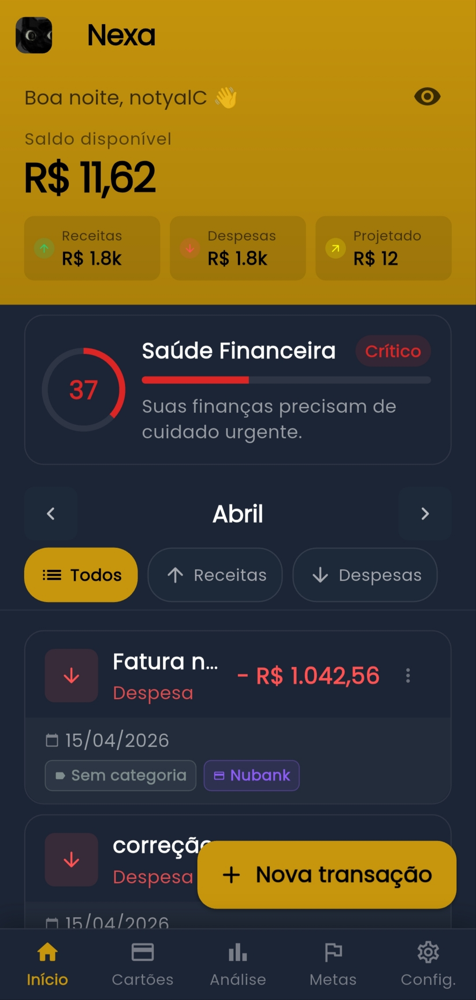
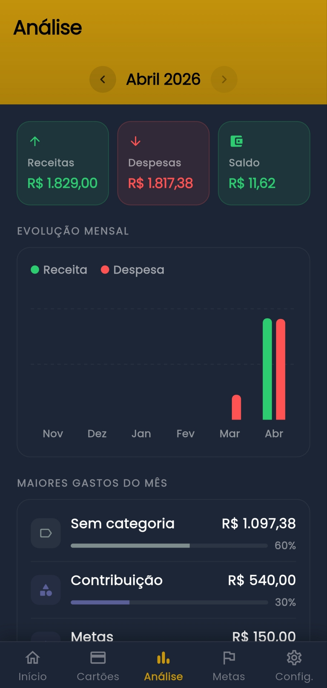
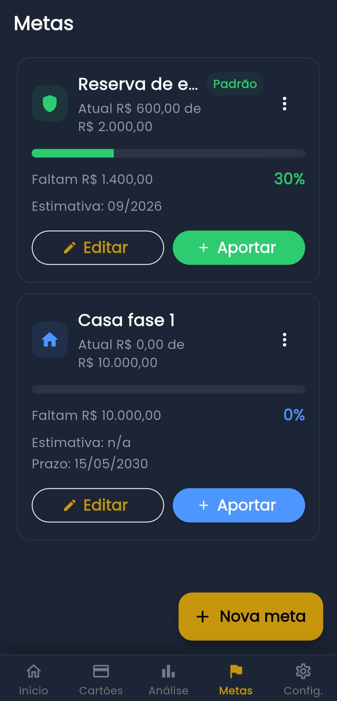

# Nexa 💳

**Controle financeiro pessoal simples, moderno e eficiente.**

O Nexa é um aplicativo de gestão financeira desenvolvido com **Flutter**, projetado para oferecer uma experiência fluida e inteligente na organização do seu dinheiro. Ele combina um design minimalista com ferramentas robustas de análise e planejamento.

> **Status do Projeto:** Versão 1.4.0 (Estável)
> 
> [📥 Baixar Última Versão (APK)](https://github.com/notyalC0/Nexa-App/releases/latest)

---

## 📱 Interface do Projeto

Abaixo, você pode conferir a estética minimalista e moderna do Nexa:

| Home & Saldo | Análise Financeira | Metas de Economia |
| :---: | :---: | :---: |
|  |  |  |

---

## ✨ Principais Diferenciais

### 🎯 Gestão de Metas Inteligente
Planeje seu futuro com a nova aba de Metas. Crie objetivos (como uma viagem ou reserva de emergência), registre aportes e visualize estimativas reais de quando você alcançará seu sonho com base no seu ritmo atual.

### 📊 Análise e Insights Reais
Não apenas registre gastos, entenda-os. O Nexa oferece dashboards com gráficos de evolução mensal, distribuição por categorias e cartões, além de um monitoramento de orçamento vs. renda.

### 💳 Ciclo de Cartão de Crédito Automático
Esqueça a confusão de datas. O app calcula automaticamente o impacto financeiro das suas compras com base no fechamento e vencimento da fatura, distinguindo a **data da compra** da **data efetiva** no seu saldo.

### ⚙️ Automação e Recorrência
Gerencie despesas fixas e parcelamentos com facilidade. O sistema trata a distribuição de centavos em parcelas e gera transações recorrentes automaticamente para você.

---

## 🚀 Tecnologias Utilizadas

Este projeto demonstra a aplicação de padrões modernos de desenvolvimento mobile:

- **Framework:** Flutter (Dart)
- **Gerenciamento de Estado:** Riverpod 3 (Arquitetura reativa)
- **Banco de Dados:** SQLite (com suporte a Desktop via FFI)
- **Animações:** Animações implícitas e sequenciais para UX fluida
- **Notificações:** Sistema de lembretes locais agendados
- **Local Storage:** Persistência de perfil e configurações customizadas

---

## 📜 O que há de novo (v1.4.0)

- **Nova aba Metas:** Criação, edição e progresso de objetivos financeiros.
- **Lógica de Competência:** Distinção entre data de compra e data de impacto no saldo.
- **Reserva de Emergência:** Migração automática da antiga configuração para o novo sistema de metas.
- **Melhorias Visuais:** Novos badges de categoria e cartões nas listas de transações.

*Confira o histórico completo no [CHANGELOG.md](CHANGELOG.md).*

---

## 📥 Como Instalar

1. Acesse a aba [Releases](https://github.com/notyalC0/Nexa-App/releases).
2. Baixe o arquivo `app-release.apk`.
3. No seu Android, permita a instalação de fontes desconhecidas.
4. Instale e comece a organizar sua vida financeira!

---

## 💬 Feedback e Contribuição

Sua opinião é fundamental para a evolução do Nexa! Se você encontrou um bug ou tem uma sugestão de melhoria, siga os passos abaixo:

### Relatando um Problema (Issue)
1. Acesse a aba [Issues](https://github.com/notyalC0/Nexa-App/issues) deste repositório.
2. Clique em **New Issue**.
3. Descreva detalhadamente o ocorrido ou a sugestão. 
   - *Para bugs:* Inclua os passos para reproduzir o erro e, se possível, o modelo do seu dispositivo.
   - *Para sugestões:* Explique como a nova funcionalidade ajudaria no seu controle financeiro.

### Contato Direto
Para outras dúvidas ou feedbacks rápidos, você também pode entrar em contato via e-mail: [kureitonsanturu@gmail.com](mailto:kureitonsanturu@gmail.com).

---

## 🛡️ Propriedade Intelectual e Licença

Este é um projeto proprietário. O código-fonte está hospedado em um repositório privado para fins comerciais. O binário (APK) distribuído neste repositório é ofuscado para proteção de propriedade intelectual.

**Copyright © 2026 Clayton Reis dos Santos. Todos os direitos reservados.**

---
*Desenvolvido com ❤️ por [notyalC](https://github.com/notyalC0)*
